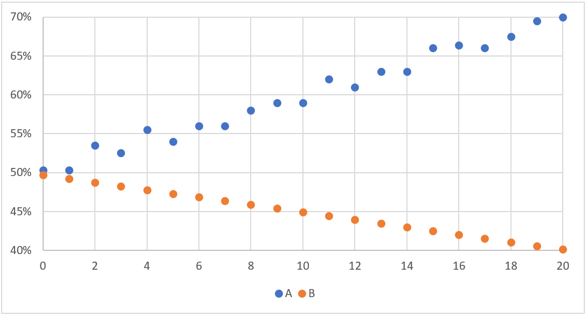

# Data Science Questions:

### 1. Pet Detection

(General data science > Confusion matrix > Machine learning > easy)

A classifier that predicts if an image contains only a cat, a dog, or a llama produced the following confusion matrix:


|   |   |  True values |   |   |
|---|---|---|---|---|
|   |   | Dog  | Cat  |  Llama |
|  Predicted values | Dog  | 14  | 2  |  1 |
|   |  Cat |  2 | 12  |  3 |
|   |  Llama |  5 | 2  |  19 |

What is the accuracy of the model, in percentages?

##### Answer:
Accuracy = TP + TN / TP + TN + FP + FN

Which is the number of correct predictions divided by the total number of predictions

Accuracy = (14+12+19) / (45 + 2+1+2+3+5+2) = 0.75


### 2. Petri Dish

(General data science > Correlation > easy)

Two bacteria cultures, A and B, were set up in two different dishes, each covering 50% of its dish. Over 20 days, bacteria A's percentage of coverage increased to 70% and bacteria B's percentage of coverage reduced to 40%:



1). Which of the two bacterium's growth correlates more linearly with the number of days passed?
- A
- B
- It can not be determined.

2). Approximately, what is the Pearson correlation coefficient of bacteria B's coverage and the number of days passed?
- 1
- [0.2, 0.6]
- 0
- [-0.6, -0.2]
- -1

3). If, after 20 days, bacteria A's coverage starts to correlate less with its linear trend line, what can we say about the value of its Pearson correlation coefficient?
- It will stay the same.
- It will decrease.
- It will increase.
- It can not be determined.

##### Answers:
1. B
2. -1
3. It will decrease


### 3. Election Poll

(General Data Science > Descriptive Statistic > Exploratory data analysis > Easy)

Each day during 2019 an agency asked a hundred randomly selected people which party they would vote for if elections were held that day. 
Results of the poll were recorded in the following [file](./files/election_poll.csv). The Workers' Party asked for the report which they plan to use to improve their strategy for upcoming elections.

Fill in the missing values in the report for 2019:

1. The arithmetic mean of votes for the Workers' Party is: ____ (rounded to one decimal place)
2. The median of votes for the Workers' party is: ____ (rounded to closest integer)
3. The standard deviation of votes for the Workers' party is: ____ (rounded to one decimal place)
4. The difference between the largest and the smallest number of votes for the Workers' party for March is: ____
5. The largest number of votes that any party received on any day is: ____ votes.
6. That maximum was achieved on 2019-__-__ by ____
7. The party with the largest difference between the maximum and minimum number of votes is ____. That difference is ____ votes.

##### Answers:
See python file: [election_poll.py](./election_poll.py)
1. 28.7
2. 29
3. 3.8
4. 9
5. 37
6. 2019-12-19  Civic Party
7. Alliance Party  34


### 4. Forest Fruits Weight

If you have initially 1000 kg of forest fruits which are 99% water but a week later these forest fruits are 98% water 
due to the evaporation process. What is now the mass of the forest fruits?

1. 980
2. 989.89
3. 500
4. 490

##### Answer:
```
Initially:
total = 1000 kg
water = total * 0.99 = 990 kg
other = total * 0.01 = 10 kg

After evaporation:
other remains the same = 10 kg  but this is now 2%
total = 10 kg / 0.02 = 500 kg
water (98%) = 500 * 0.98 = 490 kg
```


### 5. Dog Classification

(General Data Science > Classification > Decision Boundary > Hard)

The [file](./files/dog_classification.csv) contains the data from a classifier model that predicts if an image contains a dog

The first column contains information if the dog is in the image or not. 
The second column contains the classifier prediction, which is in the interval 0-100, 
with higher values meaning that the classifier is more confident that image contains a dog.

What is the value of the decision boundary that will maximize the accuracy of the model? 
Values greater than or equal to the decision boundary will be treated as positive.

##### Answer:
See python file: [dog_classification.py](./dog_classification.py)


### 6. Global minimum

Suppose f(x) has a global minimum at x=x<sup>*</sup>. Which of the following must be true?
1. f'(x\*) = 0
2. x = x\* is a unique global minimum of f
3. f(y) >= f(x\*) for all y (where f(y) is defined)
4. f''(x) > 0

##### Answer:
f'(x\*) = 0 is true, but it is also true for any local maximum or minimum. And we don't know if f' is defined at that point.

It can be a global minimum but the definition of global minimum is f(x\*) <= f(x) so it is not necessarily unique.

f(y) >= f(x\*) for all y (where f(y) is defined) is the definition of global minimum.

f''(x) > 0 indicates a local minimum at x not necessarily a global minimum.


### 7. Local minimum

Suppose a cost function f(x) has a local minimum at x=x\*. 
Also assume the function f(x) and its derivative f'(x) is defined for all real numbers x. 
Which of the following is true?
1. f'(x\*) = 0
2. f(x\*) = 0
3. f(y) >= f(x\*) for all y
4. f''(x\*) exists and f''(x\*) >= 0

##### Answer:
f'(x\*) = 0 must be true in a local minimum and we know that function is defined.

As the cost function measures the error, it does not make sense a negative error, 
and if the error is 0 that would be a global minimum, not local.

If all f(y) are equal or greater, x\* would be again a global minimum.

f''(x\*) exists but we want it to be f''(x\*) > 0 otherwise it could be just an inflexion point or some other edge case.


### 8. Series expression

P<sub>n</sub> = a P<sub>n-1</sub> where a >0, P<sub>0</sub> > 0 and n is any positive integer.
What is an expression for P<sub>n</sub> as a function of a and P<sub>0</sub>

1. P<sub>n</sub> = a P<sub>0</sub>
2. P<sub>n</sub> = a<sup>n</sup> P<sub>0</sub>
3. P<sub>n</sub> = na P<sub>0</sub>
4. P<sub>n</sub> = na<sup>n</sup> P<sub>0</sub>
5. P<sub>n</sub> = a<sup>1-n</sup> P<sub>0</sub>

##### Answer:
As P<sub>1</sub> = a P<sub>0</sub>

And  P<sub>2</sub> = a P<sub>1</sub> = a a P<sub>0</sub> = a<sup>2</sup> P<sub>0</sub>

The solution is the option 2.


### 9. Correlation vs covariance

We have two variables; x and y. correlation(x,y)=0.
Which of the following is necessarily correct?
1. x is independent of y
2. covariance(x,y) = 0
3. x is not a function of y

##### Answer:
Covariance indicates the direction of the linear relationship (is not standardized).

Correlation measures both the strength and the direction of the linear relationship and it is standardized (-1 to 1).

Correlation if function of the covariance. ( corr = cov / (Sigma(x)*Sigma(y)) )

Then option 2


### 10. Classification

We want to predict probability of death of heart disease based on factors: ages, gender and blood pressure.
Which method is appropriate for this case?

1. Logistic Regression
2. Linear Regression
3. K-mean clustering
4. Apriori Algorithm

##### Answer:
Logistic can create a classification and it is used quite often as a baseline model for classification.

Linear regression is more suitable for predicting continuous outputs.

K-mean clustering will create automatic clusters as per the data distribution, but not necessarily the classification that we aim for, and with probabilistic values is computationally heavy for 3D or higher dimensional data.

Apriori is used to find frequent item-sets in a dataset for boolean association rule. Name of the algorithm is Apriori because it uses prior knowledge of frequent item-set properties. It proceeds by identifying the frequent individual items in the dataset and extending them to larger and larger item sets as long as those item sets appear sufficiently often in the dataset.

The best option is the Logistic Regression.


### 11. Decision trees overfitting

How can you prevent a decision tree from overfitting?
Pick all the correct answers.

1. Decrease the max depth
2. Increase the min split
3. Decrease the min split
4. Increase the max depth

##### Answer:
There are several approaches to avoid overfitting in decision trees, mainly:
- Pre-pruning: stop growing the tree earlier, before it perfectly classify the set
- Post-pruning: allows the tree to grow and then post prune the tree
The second is more successful as it is not easy to estimate when to stop growing the tree.
Limiting the number of branches or their depth will reduce overfitting.
- Decrease the max depth
- Decrease the min split


### 12. Individuals classification

After studying the behavior of a population, you have identified four specific individual types that are most valuable to your study.
You would like to find all users who are most similar to each individual type.
Which algorithm is most appropriate for this study?

1. Linear regression
2. Decision trees
3. Random Forest
4. K-mean clustering

##### Answer:
K-mean clustering would help to create the groups if you haven't identified them already.

Linear regression would help if we want to predict some value, not in the classification.

Decision trees & Random forest will solve the classification, but random forest will benefit from creating multiple models that can be decision trees each one of them contributing to the solution. Thus Random forest will leverage the power of multiple models and easily achieve greater accuracy in our classification.

In this case the key is that we already have 4 base archetypes and they imply that there are key differences between them, so we can easily create a Decision Tree model based on the key differences for the decisions of the classification.


### 13. Deterministic outcome

Which of the following stages in a machine learning process gives a deterministic outcome?
Pick all correct answers.

1. PCA
2. Random forest model building
3. Random forest prediction stage
4. Logistic regression prediction stage
5. K-means clustering

##### Answer:
K-mean clustering would depend on the random initialisation and may result in different clusters each time.

The random forest model building may generate different models (as implied in 'random') depending on which features are selected for which model in each training.

On the other hand, PCA (Principal Component Analysis) identifies the hyper-plane in which the projections of the current data will retain the most information (or has the smallest error compared to the original data).

And the trained models will behave in a deterministic way in the prediction stage, providing always the same answer for the same inputs.


